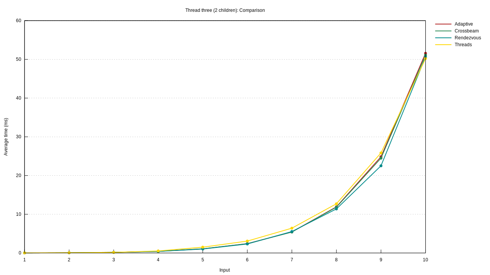

Rendezvous is a futex and atomics based implementation of an adaptive barrier, also known as a wait group.

It is primarily intended as a pedagogical resource and training exercise, as benchmarks show that is does not outperform mutexes and condvar based implementations.

